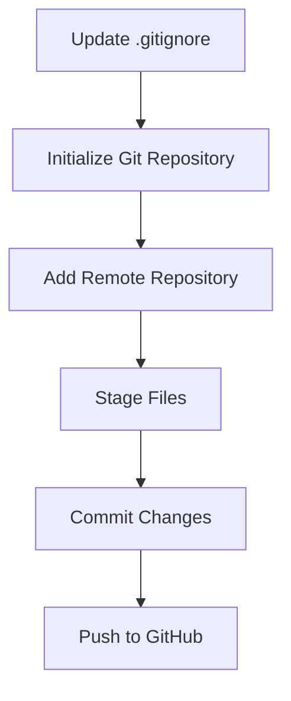

# Git Commit Plan

## Overview
This plan outlines the steps to commit the Flutter project to GitHub repository https://github.com/desdodec/app_master.git while permanently ignoring the assets folder.

## Steps

### 1. Update .gitignore File
First, we need to update the .gitignore file to include the assets folder. We'll add `/assets/` to the existing .gitignore file.

### 2. Initialize Git Repository
Since Git hasn't been initialized yet, we need to:
- Initialize a new Git repository with `git init`
- Configure the repository with your GitHub information

### 3. Add Remote Repository
- Add the GitHub repository as a remote with `git remote add origin https://github.com/desdodec/app_master.git`

### 4. Stage Files
- Stage all files except those ignored in .gitignore with `git add .`

### 5. Commit Changes
- Create an initial commit with a descriptive message using `git commit -m "Initial commit"`

### 6. Push to GitHub
- Push the commit to the main branch of your GitHub repository with `git push -u origin main` (or master, depending on your default branch name)

## Process Flow

## Potential Issues and Solutions:
1. **Authentication**: You might need to authenticate with GitHub. This can be done using:
   - Personal Access Token
   - SSH keys
   - GitHub CLI authentication

2. **Branch Name**: GitHub now uses 'main' as the default branch name instead of 'master'. We'll need to check which one your repository uses.

3. **Large Files**: If your repository contains large files, you might encounter issues with GitHub's file size limits. We'll need to ensure all files are within GitHub's limits.